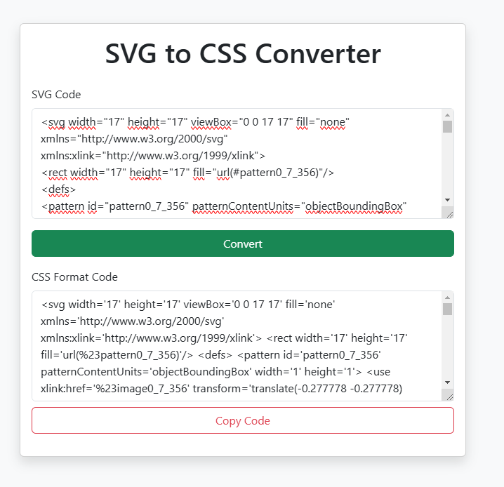

# SVG to CSS Converter

## A simple web tool to convert SVG code into CSS format.

#


## Features

- Paste SVG code and convert it into CSS.
- Copy the generated CSS code with one click.

## How to Use

1. Paste your SVG code into the "SVG Code" textarea.
2. Click the "Convert" button to generate the corresponding CSS code.
3. Copy the generated CSS code from the "CSS Code" textarea.

## Technologies Used

- HTML
- CSS
- JavaScript
- Bootstrap (for styling)

## Installation

1. Clone this repository:
   ```bash
   git clone https://github.com/senacanik/svgToCssFormatter.git
